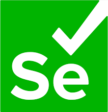

<h1 align="center" style="padding-bottom: 20px;">

  

</h1>

<h1 align="center" style="padding-top: 30px; padding-bottom: 45px;">Hi You👋.    I'm Wesley Eliel, alias Devbackend7.  </h1>

<h3 align="center" >Fullstack Web Developer | AI Enthusiast | Logic & Optimization Lover</h3>

    <a href="https://gitlab.com/WesleyEliel">
        <b>Gitlab</b>
    </a>
    ❅
    <a href="https://leetcode.com/WesleyEliel/">
        <b>LeetCode</b>
    </a>

    
    

<!--
**WesleyEliel/WesleyEliel** is a ✨ _special_ ✨ repository because its `README.md` (this file) appears on your GitHub profile.

Here are some ideas to get you started:

- 🔭 I’m currently working on ...
- 🌱 I’m currently learning ...
- 👯 I’m looking to collaborate on ...
- 🤔 I’m looking for help with ...
- 💬 Ask me about ...
- 📫 How to reach me: ...
- 😄 Pronouns: ...
- ⚡ Fun fact: ...
-->

- 🔭 I’m currently working at **<a href="https://examchic.isis-ai.com" target="_blank">Examchic</a><!--, <a href="https://wuloevents.com" style="color=black;" target="_blank">Wuloevent</a>'s Backend-->**

- 🌱 I’m Currently Learning **DevOps, System Design, Cloud Computing, Computer Vision & Machine Learning [ By Self Study]**

- 🤔 I’m looking for help for **A Master's degree in Computer Vision**

- 💬 Ask Me About **Python, Django, FastAPI, REST, NodeJS, VueJS, NuxtJS, Scraping**

- 📫 How To Reach Me **wesleymontcho@gmail.com**

- 😄 Pronouns: **He**

<!--
- 📝 I Regulary Write Articles on **[https://medium.com/@tssovi](https://medium.com/@tssovi)**
-->

<h1 align="center"></h1>

<h2 align="center">💻 Languages and Development Tools</h2>

    
    

    
    
    
    
    

    
    

    
    
    

    
    
    
    

    
    
    
    
    

    
    

    
    

    
    
    

    
    
    

<h1 align="center"></h1>

<h2 align="center">👨‍💻 Currently Learning</h2>

    
    
    

<h1 align="center"></h1>

    

    
    

<h1 align="center"></h1>

    
    
    

<h1 align="center"></h1>
